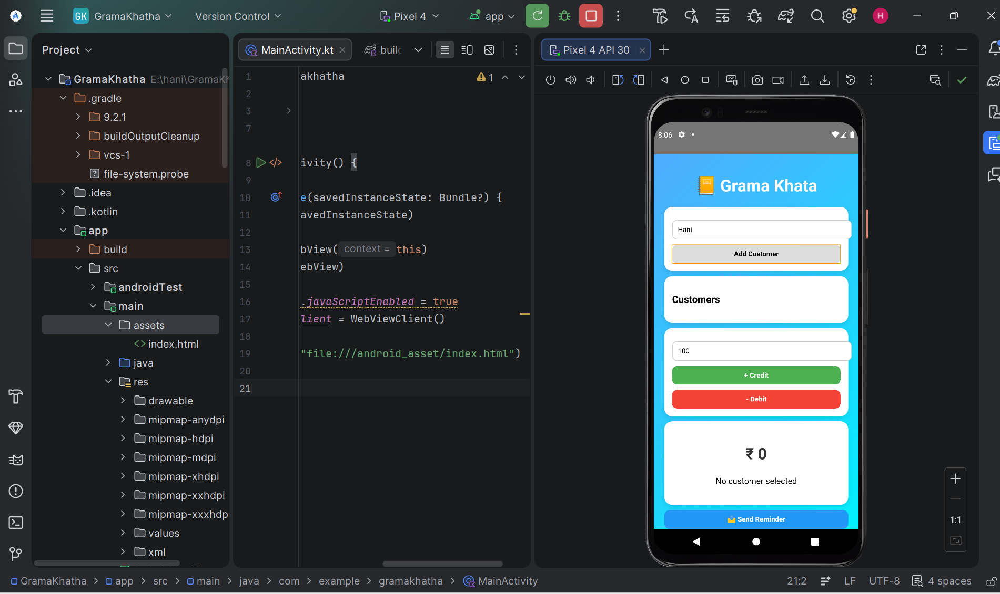

# Grama Khata – Digital Credit Ledger (Android App)

## Problem Statement
In many villages, shopkeepers still maintain customer credit records using physical notebooks. This often leads to:
- Data loss
- Calculation mistakes
- Difficulty in tracking customer dues
- Lack of proper reminders

---

## Solution
Grama Khata is an Android application that replaces manual ledger books with a simple digital system. It helps shopkeepers manage customer credit/debit records efficiently and accurately.

---

## Features
-  Add and manage customer profiles  
-  Credit (+) and Debit (-) entry system  
-  Automatic balance calculation  
-  View total pending amount per customer  
-  Reminder message generation for pending dues  
-  Simple and user-friendly Android UI  

---

## Tech Stack
- Android Studio  
- Kotlin  
- XML (UI Design)  
- SQLite / Firebase (if used)  
- Git & GitHub  

---

## Project Structure
- app/ → Main source code  
- res/layout/ → UI screens  
- res/drawable/ → Images & icons  
- manifests/ → App configuration  
- database/ → Data handling (if applicable)  

---

## How to Run the Project

1. Clone the repository:
2. Open Android Studio
3. Click: File → Open → Select Project Folder
4. Wait for Gradle sync
5. Run the app on emulator or Android device

---

## Screenshots
## 📸 Screenshots

--

## Future Improvements
 WhatsApp reminder integration
Cloud database sync (Firebase)
User login system

---

## Project Purpose
This project is built to help small shopkeepers maintain digital records of customer credit and improve financial tracking efficiency.

---

## Impact
Reduces manual bookkeeping errors
Saves time in calculations
Improves transparency in credit system
Easy tracking of customer dues

---

## Author
Name: Harika
Project: Grama Khata Android App
